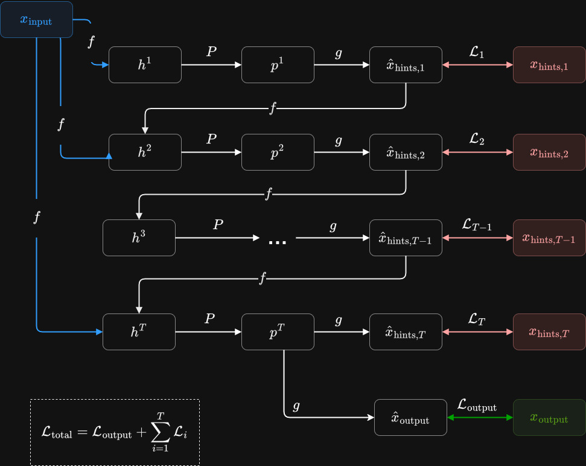

# Neural Algorithmic Reasoning

[](https://opensource.org/licenses/Apache-2.0)
[](https://github.com/ronaldalbrt/algo_reasoning/actions/workflows/test.yaml)

An extensible Python package for Neural Algorithmic Reasoning under the PyTorch framework, developed by [Ronald Albert](https://ronaldalbrt.github.io/), [Gerson Zaverucha](https://www.cos.ufrj.br/~gerson/) e [Aline Paes](http://www2.ic.uff.br/~alinepaes/).

## Overview

Neural Algorithmic Reasoning (NAR) is a field that combines neural networks with algorithmic reasoning to solve complex problems. This package provides a framework for training neural networks to learn and execute classical algorithms from the Introduction to Algorithms textbook (CLRS).

This package follows the framework implemented in [The CLRS Algorithmic Reasoning Benchmark](https://github.com/google-deepmind/clrs) and provides tools for training neural networks to learn and execute classical algorithms within the PyTorch framework.

<div align="center">
    
</div>

## Features

- **Multiple Processor Architectures**:
  - [Message Passing Neural Networks (MPNN)](https://arxiv.org/abs/1704.01212)
  - [Graph Attention Networks (GAT)](https://arxiv.org/abs/1710.10903)
  - Spectral Message Passing Neural Networks - SpectralMPNN
  - Polynomial SpectralMPNN

- **PyTorch Lightning Integration**: Easy training and evaluation with PyTorch Lightning.

- **Flexible Data Handling**: Support for both on-the-fly data generation and pre-generated datasets.

## Installation

### Prerequisites

- Python 3.7+
- PyTorch
- PyTorch Geometric
- PyTorch Lightning

### Install from source

```bash
git clone https://github.com/ronaldalbrt/algo_reasoning.git
cd algo_reasoning
pip install -e .
```

## Usage

### Basic Training Example

```python
from algo_reasoning.src.models.network import EncodeProcessDecode
from algo_reasoning.src.sampler import CLRSDataset
from algo_reasoning.src.losses.AlgorithmicReasoningLoss import AlgorithmicReasoningLoss
from algo_reasoning.src.lightning.AlgorithmicReasoningTask import AlgorithmicReasoningTask
from torch.utils.data import DataLoader
import lightning as L

# Create datasets
train_dataset = CLRSDataset(["insertion_sort"], [16], 32, 100, seed=42)
val_dataset = CLRSDataset(["insertion_sort"], [16], 32, 32, seed=42)

# Create dataloaders
train_dataloader = DataLoader(train_dataset, batch_size=None, num_workers=4)
val_dataloader = DataLoader(val_dataset, batch_size=None, num_workers=4)

# Create model
model = EncodeProcessDecode(["insertion_sort"], processor="spectralmpnn")

# Create loss function and lightning module
loss_fn = AlgorithmicReasoningLoss(lr=1e-3, weight_decay=1e-2)
lightning_module = AlgorithmicReasoningTask(model=model, loss_fn=loss_fn)

# Train model
trainer = L.Trainer(max_epochs=100, accelerator="gpu", devices=1)
trainer.fit(lightning_module, train_dataloader, val_dataloader)
```

### Using the Command Line

You can also train models using the provided `run.py` script:

```bash
python run.py --algorithms insertion_sort,bubble_sort --nb_nodes 4,7,11,13,16 --batch_size 32 --n_epochs 100 --processor_model spectralmpnn --model_name sorting_model
```

## Evaluation

The package provides evaluation metrics for algorithmic reasoning tasks:

- ROC AUC
- Accuracy
- F1 Score
- Precision
- Recall

## Project Structure

- `algo_reasoning/src/algorithms/`: Implementation of classical algorithms
- `algo_reasoning/src/models/`: Neural network architectures
- `algo_reasoning/src/lightning/`: PyTorch Lightning modules
- `algo_reasoning/src/losses/`: Loss functions
- `algo_reasoning/src/data.py`: Data handling utilities
- `algo_reasoning/src/sampler.py`: Data sampling utilities
- `algo_reasoning/src/eval.py`: Evaluation metrics
- `algo_reasoning/src/specs.py`: Algorithm specifications
- `test/`: Unit tests

## Contributing

Contributions are welcome! Please feel free to submit a Pull Request.

## License

This project is licensed under the Apache License 2.0 - see the [LICENSE](LICENSE) file for details.

## Citation

If you use this code in your research, please cite:

```
@software{albert2024neural,
  author = {Albert, Ronald and Zaverucha, Gerson and Paes, Aline},
  title = {Neural Algorithmic Reasoning},
  url = {https://github.com/ronaldalbrt/algo_reasoning},
  year = {2024}
}
```

## Acknowledgments

- This project follows the framework implemented in [The CLRS Algorithmic Reasoning Benchmark](https://github.com/google-deepmind/clrs)
